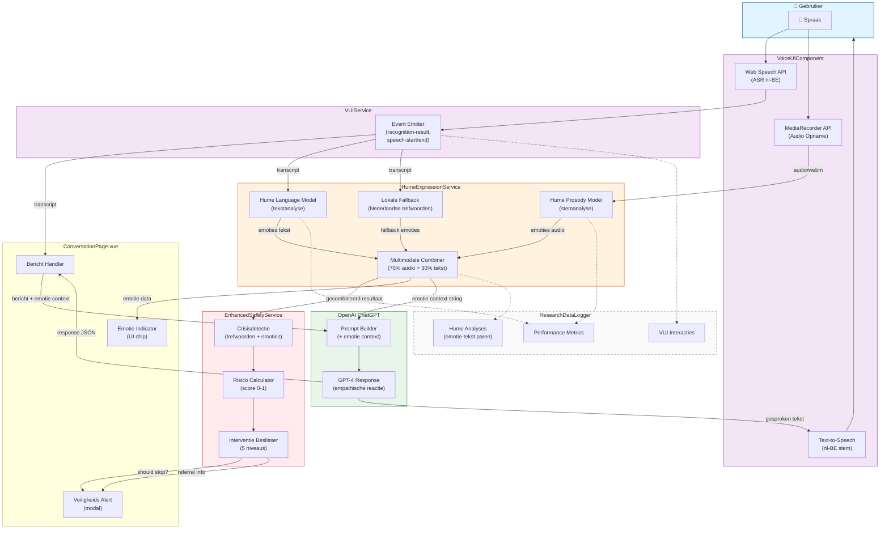

# Figuur 5.5: Architectuurdiagram van Goose emotie-analyse integratie

## Beschrijving

Dit diagram toont de architectuur van de Goose emotie-analyse integratie:

1. **Gebruikersinput**: Spraak wordt gelijktijdig verwerkt door de Web Speech API (voor transcriptie) en de MediaRecorder API (voor audio-opname).

2. **VUIService**: Centraliseert alle spraak-events via een event-emitter patroon, waardoor losse koppeling mogelijk is.

3. **HumeExpressionService**: Voert multimodale analyse uit:
   - Prosody Model: analyseert stemkenmerken (toon, tempo, intensiteit)
   - Language Model: analyseert emotie in tekst
   - Lokale Fallback: detecteert Nederlandse emotie-trefwoorden
   - Combiner: weegt resultaten (70% audio, 30% tekst)

4. **EnhancedSafetyService**: Berekent risico-score op basis van:
   - Crisis-trefwoorden (zelfmoord, wanhoop, etc.)
   - Emotie-indicatoren (wanhoop, angst, verdriet)
   - Emotionele trend over tijd
   - Bepaalt interventieniveau (none → stop-conversation)

5. **ChatGPT**: Ontvangt het gebruikersbericht samen met emotie-context, wat leidt tot empathische reacties.

6. **ResearchDataLogger**: Registreert alle interacties en analyses voor onderzoeksdoeleinden.

