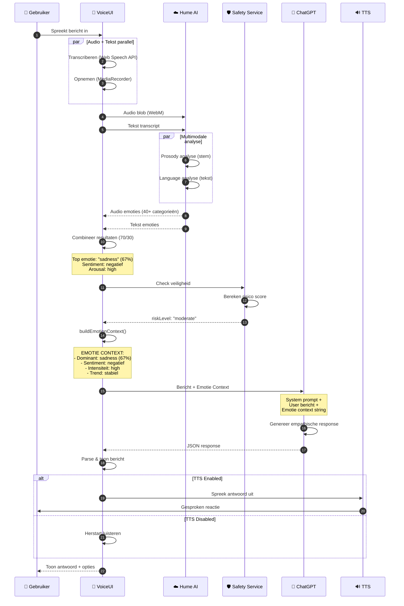

# Figuur 5.10: Sequentiediagram van emotie-context integratie met ChatGPT



## Voorbeeld Prompt Augmentatie

### Zonder emotie-context:
```
User: Ik voel me de laatste tijd niet zo goed.
```

### Met emotie-context:
```
User: Ik voel me de laatste tijd niet zo goed.

EMOTIE CONTEXT:
Emoties: sadness (67%), anxiety (45%), tiredness (38%)
- Dominant: sadness (67%)
- Sentiment: negatief
- Intensiteit: high
- Trend: stabiel

Pas je reactie empathisch aan. Toon begrip, blijf gesprekscoach.
```

## Impact op ChatGPT Response

| Aspect | Zonder Context | Met Context |
|--------|----------------|-------------|
| Toon | Neutraal, informatief | Warm, empathisch |
| Vraagstelling | "Wat bedoel je daarmee?" | "Dat klinkt zwaar. Wil je me vertellen wat er speelt?" |
| Hulpaanbod | Niet proactief | "Als je wilt, kunnen we samen kijken..." |
| Doorverwijzing | Niet aanwezig | Bij hoog risico: hulplijn suggereren |


