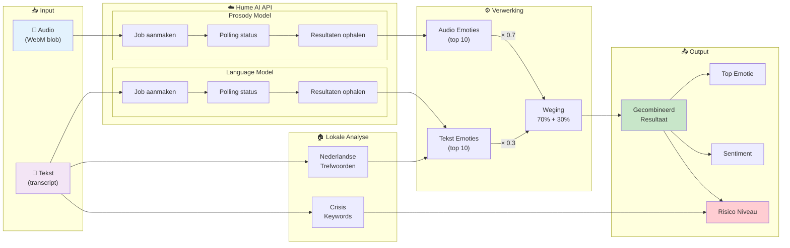

# Figuur 5.8: Flowdiagram van multimodale emotie-analyse (audio + tekst)

## Toelichting

De multimodale analyse combineert twee informatiebronnen:

| Bron | Model | Gewicht | Wat wordt geanalyseerd |
|------|-------|---------|------------------------|
| Audio | Prosody | 70% | Toon, tempo, intensiteit, trillingen |
| Tekst | Language | 30% | Woordkeuze, zinsstructuur, context |

### Waarom 70/30 weging?

De stemkenmerken (prosody) zijn vaak betrouwbaarder dan woorden alleen:
- Iemand kan zeggen "het gaat goed" met een trillende stem → audio detecteert spanning
- Sarcasme en ironie worden beter opgepikt via toon
- Culturele verschillen in emotie-expressie via woorden

### Fallback mechanisme

Als de Hume API niet beschikbaar is:
1. Lokale Nederlandse trefwoorden worden gescand
2. Crisis-keywords worden direct gedetecteerd
3. Een fallback-resultaat wordt geretourneerd zonder API-latentie

