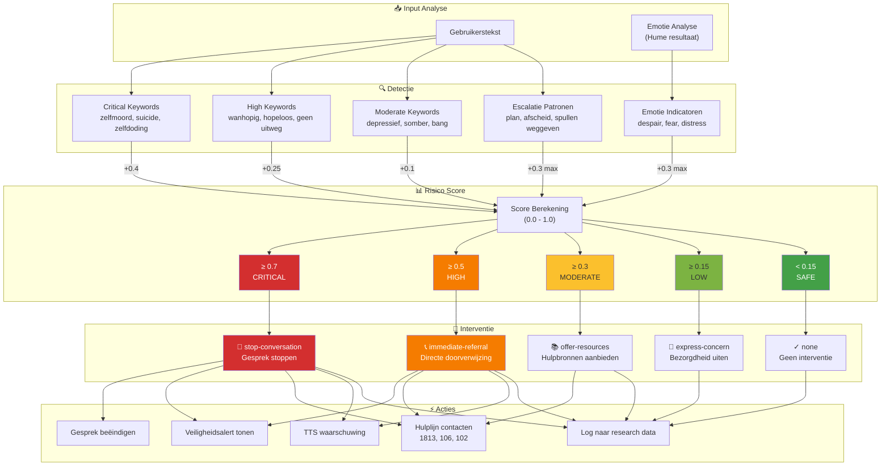

# Figuur 5.9: Crisisdetectie en Veiligheidsinterventie Flow

## Risico Niveaus en Interventies

| Risico | Score | Interventie | Actie |
|--------|-------|-------------|-------|
| **Critical** | ≥ 0.7 | stop-conversation | Gesprek stoppen, alert tonen, 1813 bellen |
| **High** | ≥ 0.5 | immediate-referral | Alert tonen, hulplijnen aanbieden |
| **Moderate** | ≥ 0.3 | offer-resources | Hulpbronnen voorstellen |
| **Low** | ≥ 0.15 | express-concern | Empathisch doorvragen |
| **Safe** | < 0.15 | none | Normale conversatie |

## Hulplijnen (België)

| Naam | Nummer | Beschikbaarheid | Type |
|------|--------|-----------------|------|
| Zelfmoordlijn | 1813 | 24/7 | Crisis |
| Tele-Onthaal | 106 | 24/7 | Support |
| Awel (jongeren) | 102 | Ma-Vr 16-22u | Support |

